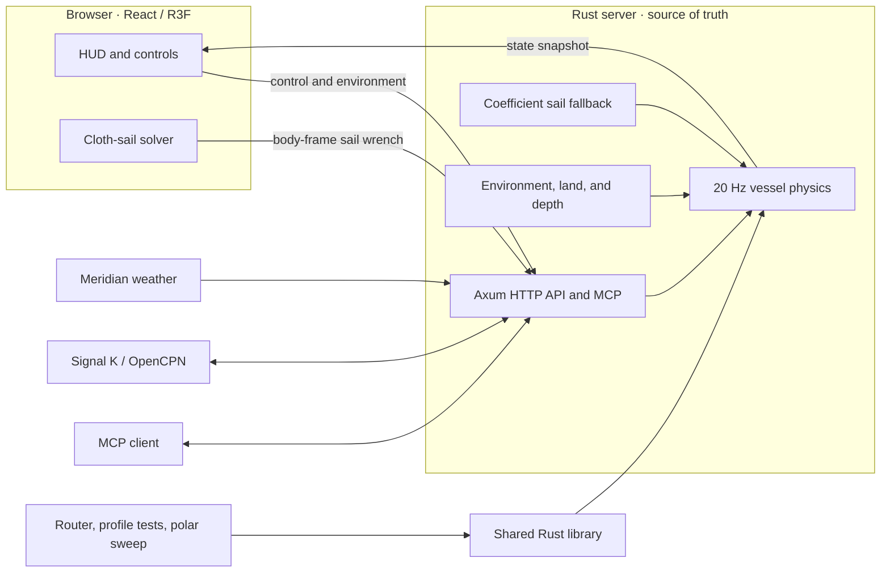

<div align="center">

# Skiff

**A server-authoritative Lagoon 450S sailing simulator and isochrone-routing research platform.**


</div>

Skiff combines a headless six-degree-of-freedom Rust simulation with an optional React and Three.js cockpit. The server owns vessel state and physics. The browser provides visualization and controls, and can feed forces from its cloth-sail simulation back into the authoritative hull model.

> [!IMPORTANT]
> Skiff is an active simulation and research project. It is not certified navigation, autopilot, or vessel-control software.

## Highlights

- **Server-authoritative physics** — approximately 20 Hz, six-degree-of-freedom Lagoon 450S dynamics with hulls, rudders, skegs, engines, sail forces, stability states, waves, grounding, and bathymetry.
- **Headless operation** — the vessel continues sailing without a browser connected.
- **Interactive 3D cockpit** — React 19, React Three Fiber, Three.js, Zustand, HUD telemetry, helm and engine controls, environmental controls, and a Verlet cloth sail.
- **Graceful sail-model fallback** — fresh browser cloth forces can drive the boat; stale input blends back to the server coefficient model instead of freezing or dropping to zero.
- **Routing and validation tools** — isochrone routing, boat-profile tests, polar sweeps, and a terminal state monitor.
- **External integrations** — optional Meridian weather, Signal K telemetry, OpenCPN route guidance, and a native Model Context Protocol endpoint.

## Architecture



The Rust process is authoritative for pose, velocity, stability, fuel, environment, grounding, and route guidance. A browser may submit an aerodynamic sail wrench while connected. If that wrench becomes stale, the server smoothly returns to its coefficient sail model.

For the underlying contracts and design rationale, read:

- [`media/skiff-architecture.md`](media/skiff-architecture.md) — approachable architecture deep dive
- [`plan/overarching_architecture.md`](plan/overarching_architecture.md) — authoritative engineering conventions
- [`runbook_pi.md`](runbook_pi.md) — Raspberry Pi and production deployment runbook

## Prerequisites

- A recent stable Rust toolchain with Rust 2024 edition support
- Node.js 22 and npm
- Optional: Docker for a containerized build
- Optional: Signal K and Meridian credentials for live integrations

## Quick start

Build the browser client, then start the Rust server:

```bash
git clone https://github.com/DeepBlueDynamics/skiff.git
cd skiff

cd web
npm install
npm run build
cd ..

cargo run --bin skiff
```

Open:

- Simulator: `http://localhost:18081/`
- Health check: `http://localhost:18081/healthz`
- MCP endpoint: `http://localhost:18081/mcp`

The default port is `18081`. Set `SKIFF_PORT` to override it locally, or `PORT` on platforms such as Cloud Run.

## Development

Run the backend and Vite development server in separate terminals.

**Terminal 1 — Rust server**

```bash
cargo run --bin skiff
```

**Terminal 2 — browser client**

```bash
cd web
npm install
npm run dev
```

Open `http://localhost:5173/`. Vite proxies simulator API requests to the Rust server on port `18081`.

Useful checks:

```bash
# Rust tests
cargo test

# Frontend typecheck and production bundle
cd web && npm run build

# Terminal telemetry dashboard
python web/monitor_sim.py

# Generate a headless polar report
cargo run --release --bin polar_sweep
```

The polar sweep writes `reports/polar_report.md`.

## Docker

The included multi-stage image builds both the browser client and the release Rust binary.

```bash
docker build -t skiff .
docker run --rm \
  -e PORT=8080 \
  -p 8080:8080 \
  skiff
```

Open `http://localhost:8080/`.

## HTTP API

Default base URL: `http://localhost:18081`

| Method | Path | Purpose |
|---|---|---|
| `GET` | `/healthz` | Liveness check |
| `GET` | `/v1/sim/state` | Full authoritative simulator snapshot |
| `POST` | `/v1/sim/control` | Helm, trim, reef, engines, traveler, and mass controls |
| `POST` | `/v1/sim/environment` | Manual wind, current, and wave conditions |
| `POST` | `/v1/sim/position` | Set latitude and longitude; land targets snap to nearby water |
| `POST` | `/v1/sim/reset` | Reset the vessel state, with an optional initial heading |
| `POST` | `/v1/sim/sail_wrench` | Submit a cloth-derived body force and torque |
| `POST` | `/v1/sim/course` | Engage or release heading or track hold |
| `POST` | `/v1/sim/sail` | Furl or deploy the sail model |
| `POST` | `/v1/sim/refuel` | Refill both fuel tanks |
| `POST` | `/v1/auth/token` | Install a user token for live Meridian data |
| `POST` | `/v1/auth/logout` | Clear the live-data token and live-weather status |
| `POST` | `/mcp` | Native streamable-HTTP MCP transport |

<details>
<summary><strong>Control request example</strong></summary>

```bash
curl -X POST http://localhost:18081/v1/sim/control \
  -H 'content-type: application/json' \
  -d '{
    "helm": 0.0,
    "sail_trim": 0.76,
    "reef": 0.0,
    "thrust_port": 0.0,
    "thrust_stbd": 0.0,
    "mass_scale": 1.0,
    "traveler": 0.0,
    "fuel_burn_max_lph": 9.0
  }'
```

</details>

<details>
<summary><strong>Environment request example</strong></summary>

```bash
curl -X POST http://localhost:18081/v1/sim/environment \
  -H 'content-type: application/json' \
  -d '{
    "wind_speed_mps": 5.0,
    "wind_to_deg": 150.0,
    "current_speed_mps": 0.55,
    "current_to_deg": 85.0,
    "wave_height_m": 1.0,
    "wave_period_s": 7.0,
    "wave_to_deg": 290.0,
    "manual": true
  }'
```

Flow directions use **to-direction**: the direction toward which the wind, current, or waves travel.

</details>

<details>
<summary><strong>Cloth-sail wrench example</strong></summary>

```json
{
  "seq": 123,
  "f_body": [1200.0, 450.0, -80.0],
  "tau_body": [300.0, -120.0, 1600.0]
}
```

The body frame is `+X` forward, `+Y` starboard, and `+Z` down. The server accepts fresh cloth input and blends back to the coefficient model when updates stop.

</details>

## Model Context Protocol

MCP is built into the Rust server at `/mcp`; no separate Python bridge or process is required.

Example Claude CLI registration:

```bash
claude mcp add skiff \
  --transport http \
  http://localhost:18081/mcp
```

Available tools:

| Tool | Purpose |
|---|---|
| `get_state` | Read authoritative vessel and environment telemetry |
| `set_control` | Set helm, trim, reef, traveler, mass scale, and engine inputs |
| `set_environment` | Apply manual wind, current, and wave conditions |
| `set_position` | Move the vessel to a latitude and longitude |
| `reset` | Reset the simulation |
| `set_course` | Set heading hold, track hold, or release course control |
| `set_sail` | Furl or deploy the sail |
| `set_engines` | Set or release the shared two-engine thrust override |
| `refuel` | Refill the vessel's fuel tanks |

## Command-line tools

### Route

Run the isochrone router between two coordinates:

```bash
cargo run --bin skiff-cli -- route \
  --origin "12.00,-61.76" \
  --dest "12.25,-61.50" \
  --depart "2026-08-01T12:00:00Z" \
  --profile castoff-compatible \
  --step 900 \
  --horizon 72h \
  --out route.json
```

The current CLI route command uses the built-in constant environment provider. Treat it as a routing and geometry harness rather than a live-weather voyage planner.

### Profile test

Inspect predicted boat performance for a single condition:

```bash
cargo run --bin skiff-cli -- profile-test \
  --profile castoff-compatible \
  --wind 10kt \
  --current 0kt@0
```

### Polar sweep

Run a headless true-wind-speed × true-wind-angle sweep with trim optimization:

```bash
cargo run --release --bin polar_sweep
```

## Configuration

| Variable | Default | Purpose |
|---|---|---|
| `SKIFF_PORT` | `18081` | Preferred local HTTP bind port |
| `PORT` | unset | Platform-provided fallback port |
| `RUST_LOG` | `info` | Rust tracing filter, for example `skiff=debug` |
| `SIGNALK_HOST` | unset | Signal K server host |
| `SIGNALK_TOKEN` | unset | Signal K authentication token |
| `MERIDIAN_URL` | `https://meridian.deepbluedynamics.com` | Meridian API base URL |
| `MERIDIAN_USER_TOKEN` | unset | Optional initial user JWT for live Meridian weather |

A browser login can install a Meridian user token at runtime through `POST /v1/auth/token`; it does not require restarting the simulator.

## Repository layout

```text
skiff/
├── src/
│   ├── main.rs             # Axum server, simulation loop, integrations
│   ├── cli.rs              # Route and boat-profile CLI
│   ├── mcp.rs              # Native streamable-HTTP MCP endpoint
│   ├── cat_physics.rs      # Lagoon 450S force model and integration
│   ├── world.rs            # Land mask, grounding, and bathymetry
│   ├── boat/               # Boat profiles, polars, leeway, wave penalties
│   ├── env/                # Environment providers and interpolation
│   ├── route/              # Isochrone routing
│   ├── sim/                # Headless simulator state and stepping
│   └── bin/                # Additional binaries, including polar_sweep
├── web/                    # Vite, React, R3F, Three.js, and Zustand client
├── models/Lagoon_450S/     # Source vessel assets
├── media/                  # Public architecture documentation
├── plan/                   # Detailed engineering contracts and design work
├── Dockerfile              # Multi-stage production image
└── runbook_pi.md           # Raspberry Pi deployment runbook
```

## Engineering contracts

The following rules are load-bearing across the Rust and browser implementations:

- Rust is the source of truth for physics and vessel state.
- Internal calculations use SI units.
- Fields named `*_to_deg` describe the direction a flow travels toward.
- Body-frame forces use `+X` forward, `+Y` starboard, and `+Z` down.
- Sails consume apparent wind; water foils consume through-water velocity.
- A stale browser wrench must decay toward the coefficient sail model, never remain frozen.

Do not change coordinate frames, force signs, wind semantics, or sail attachment contracts without first updating [`plan/overarching_architecture.md`](plan/overarching_architecture.md) and the corresponding tests.

## Contributing

Before opening a pull request:

```bash
cargo test
cd web && npm run build
```

Keep the server authoritative, preserve headless operation, and add tests for changes to units, coordinates, force signs, routing behavior, or API contracts.

## Project status

Skiff is currently version `0.1.0`. Interfaces and physical models may change as validation improves. The root README intentionally focuses on setup and operation; detailed design decisions and experimental work belong in `media/` and `plan/`.

## License

MIT, as declared in [`Cargo.toml`](Cargo.toml).
